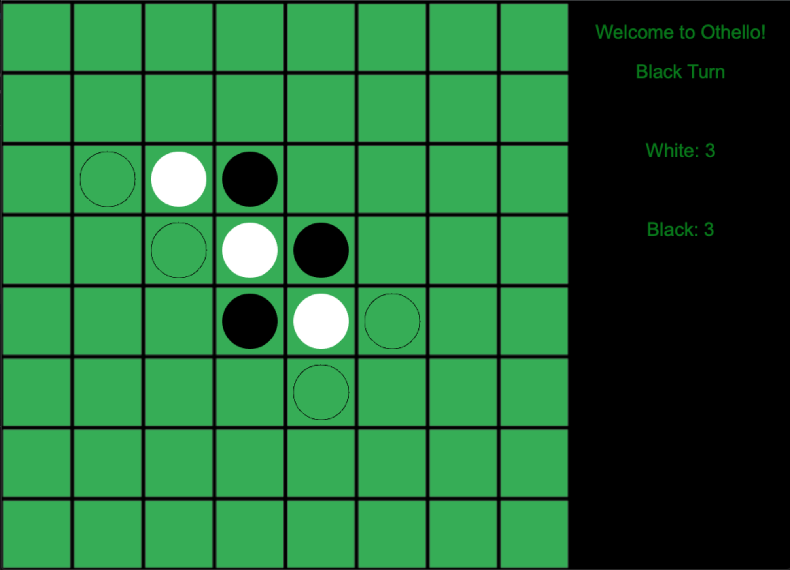

# **C++ Othello**



[](LICENSE)
[](docs/README.md)

Read [this document](https://cliutils.gitlab.io/modern-cmake/chapters/basics/structure.html) to understand the project
layout.

**Author**: Kaahan Motwani - [`kaahanm2@illinois.edu`](mailto:example@illinois.edu)

---

## **Table of Contents**
- [Getting Started](#getting-started)
    - [Downloading Cinder](#downloading-cinder-and-setting-up-othello)
    - [Setting up the SQLite Database](#setting-up-the-sqlite-database)
    - [Adding the SQLite and sql_modern_cpp dependencies](#adding-the-sqlite-and-sqlite_modern_cpp-dependencies)
- [How to Play the Game](#how-to-play-the-game)    

## **Getting Started**

### Downloading Cinder and Setting Up Othello ###

1. Download [Cinder (v0.9.2)](https://libcinder.org/) for your platform.
Extract the downloaded item into a folder.
We’ll call this folder ~/Cinder throughout the instructions.

2. If you do not have the [CLion](https://www.jetbrains.com/clion/) IDE,
it may be best to download it. CLion comes with [CMake](https://cmake.org/) and since this
is a CMake Project, you will need CMake to run the project. If you are using VSCode, see [this](https://medium.com/@sam.romano18/visual-studio-code-setup-for-beginners-using-c-and-cmake-e92ab4f1fba1) to get more information on how to run a CMake project.

2. Open the ~/Cinder folder into the CLion IDE (and click the green build button.
This will build libcinder. You only need to do this once
per machine. This build might take a while.

3. Create a directory, say my-projects in ~/Cinder.
Clone the C++ Othello project into this folder.

4. Open the snake project in CLion, set the target to
cinder-othello and click the run button.

MacOS users: It’s possible that you may come across:

```
Error running 'cinder-othello': Cannot run program … cinder-othello.app/Contents/Resources"): error=13, Permission denied
```

In this case, try doing: Edit configurations -> Executable -> Select Other ->
Find ```my-projects/othello/cmake-build-debug/Debug/cinder-othello/Contents/MacOS/cinder-othello```
And click run once again.

### Setting up the [SQLite](https://www.sqlite.org/index.html) Database ###

1. In CLion, navigate to View > Tool Windows > Database.
2. Next, in the Database window, select the Database properties button,
which is between the Refresh and the Stop button.
3. There are two possibilities now: i. If properties for snake.db are automatically selected, you can proceed to
Step 4. ii. If there are no database properties selected, navigate to Add > SQLite.
4. Next, there should be a highlighted link to download the necessary drivers for SQLite. Click this link.
5. For the file of the datasource, select othello-kaahanmotwani/assets/snake.db.
6. Press Test Connection to verify that the driver is set up correctly. Click the OK button in the
7. Now, you should run the cinder-snake target and play the game to test out your database.
8. After the cinder-snake application has run, go back to the Database tab, click the Refresh button.
You should now be able to see the schema of the database under snake.db > schemas > main > scoreboard.
Also, you’ll be able to manually execute queries by clicking the Jump to Console button at the top.

### Adding the SQLite and sqlite_modern_cpp dependencies ###

In othello-kaahanmotwani/CMakeLists.txt:

```
FetchContent_Declare(
        sqlite3
        GIT_REPOSITORY https://github.com/alex85k/sqlite3-cmake.git
        GIT_TAG v3.24.0
)
```

This will download a Git repository into your build folder.
The first argument is the name that you want to refer to the entity as.

Then add the following to othello-kaahanmotwani/CMakeLists.txt:

```
FetchContent_Declare(
        sqlite-modern-cpp
        GIT_REPOSITORY https://github.com/SqliteModernCpp/sqlite_modern_cpp.git
        GIT_TAG a0f96c10f04d96ccea1b8a49d5998c96e7887bf4
)
```

This will add the dependency for [sqlite_modern_cpp](https://github.com/SqliteModernCpp/sqlite_modern_cpp).

We are using the SqliteModernCpp library to make SQLite queries from C++. Take a look at the examples
here: https://github.com/SqliteModernCpp/sqlite_modern_cpp/tree/dev.

Then, you'll do something like this for both sqlite3 and sqlite_modern_cpp,
still in othello-kaahanmotwani/CMakeLists.txt:

```
FetchContent_GetProperties(sqlite3)
if (NOT sqlite3_POPULATED)
    FetchContent_Populate(sqlite3)
    add_subdirectory(${sqlite3_SOURCE_DIR} ${sqlite3_BINARY_DIR})
    target_include_directories(sqlite3 INTERFACE ${sqlite3_SOURCE_DIR}/src)
endif ()
```

```
FetchContent_GetProperties(sqlite-modern-cpp)
if (NOT sqlite-modern-cpp_POPULATED)
    FetchContent_Populate(sqlite-modern-cpp)
    add_library(sqlite-modern-cpp INTERFACE)
    target_include_directories(sqlite-modern-cpp INTERFACE ${sqlite-modern-cpp_SOURCE_DIR}/hdr)
endif ()
```

Notice that sqlite3 and sqlite_modern_cpp are CMake projects, so you can add it as a subdirectory of your project.
This piece of code adds sqlite3 and sqlite_modern_cpp as a subdirectory of your project, which will expose any targets
that sqlite and sqlite_modern_cpp defines.

NOTE: It is important that your variable names are all lowercase for FetchContent.
The FetchContent_Populate(<name>) method will convert <name> into lowercase, so just make all of the names lowercase.
See more here: https://cmake.org/pipermail/cmake/2018-March/067185.html.

## **How to Play the Game** ##

For the full rules of Othello (also commonly known as Reversi), click [here](https://en.wikipedia.org/wiki/Reversi).

###### **Quick Summary of the Rules:**

    - There are two players, one will be black and the other will be white
    - The goal of the game is to try to have the most pieces at the end
    - Players will alternate turns, unless a player has no valid moves
    (in this case, the other player will go again)
    - A valid move is defined as a move that flips pieces of the other color
    - Pieces can only be flipped if there is a piece of your color on the
    opposite side, leaving pieces of the opposite color in the middle

###### **Features of my game**

 - You can only click on valid moves. Valid moves are indicated by circles
 that are not filled in.
 - When you hover over a valid move, you can see what the board would
 look like if you played that move.
 - The scores and whose turn it is will be kept track of
 in the panel to the right side
 - Once the game has finished, the result of the game will be populated
 into a sqlite database (scoreboard.db), with the winner, loser, and
 the winner's score
 - When the game has ended, a restart button will appear, allowing you to play
 again without restarting the Cinder application
 - There are sounds that will be played throughout the game! Have fun!
